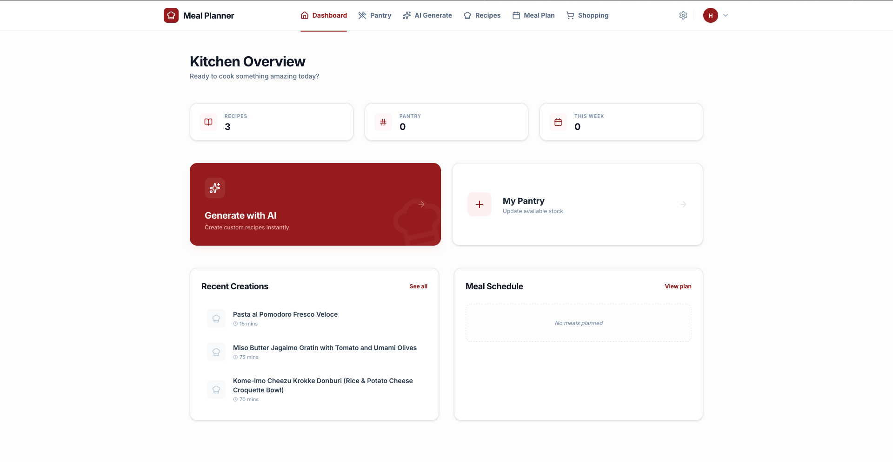
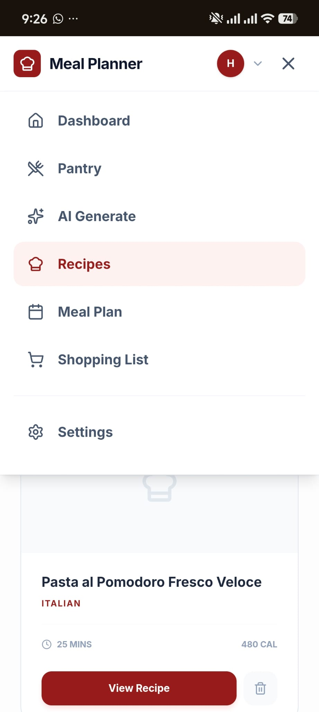
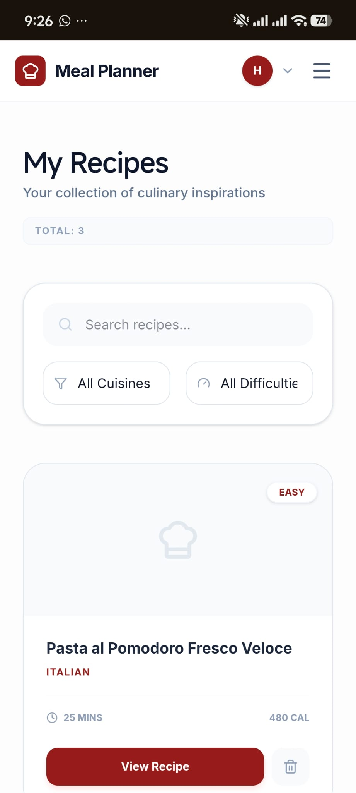
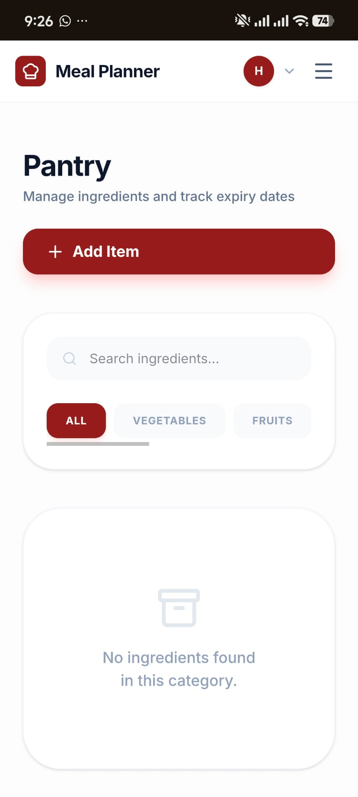

# 🍽️ Meal Planner & AI Recipe Generator

A modern kitchen management and intelligent meal planning application that helps users reduce food waste, save time, and cook smarter using AI-powered recipe generation.

This project allows users to manage their pantry inventory, create weekly meal plans, and generate personalized recipes based only on the ingredients they already have.

---

## 🖼️ Preview

  

  
  
  

---

## 🚀 Features

### 🧺 Smart Pantry Management
- Digitally track available ingredients
- Reduce food waste by cooking with existing stock

### 🤖 AI Recipe Generator
- Generates custom recipes based only on pantry contents
- Uses OpenAI / Gemini integrations
- Avoids unnecessary ingredient suggestions

### 📅 Weekly Meal Planner
- Organize meals in a weekly layout
- Supports consistent and structured nutrition planning

### 🛒 Dynamic Shopping List
- Automatically detects missing ingredients
- Creates a consolidated shopping list from meal plans

### 🎨 Modern UI/UX
- Crimson Red themed interface
- Built with React and Tailwind CSS
- Clean, minimal, and intuitive design

### 📱 Fully Responsive
- Optimized for mobile, tablet, and desktop
- Custom mobile navigation experience

---

## 🛠️ Tech Stack

### Frontend
- React.js
- Vite
- Tailwind CSS
- Lucide Icons

### Backend
- Node.js
- Express.js

### Database
- PostgreSQL (Neon DB)

### Authentication
- JSON Web Token (JWT)

### Deployment
- Railway (Backend)
- PHP Shared Hosting (Frontend)

---

## 🧠 Development Approach

This project was developed by combining solid software engineering principles with the strategic use of Artificial Intelligence.

- Core architecture and feature decisions were defined by the developer
- AI was used as a pair programmer for debugging, deployment support, and configuration
- All critical decisions and validations were made manually

---

## ⚙️ Installation & Setup

### 1️⃣ Clone the repository

    git clone https://github.com/buketozceylan/meal-planner.git

### 2️⃣ Install backend dependencies

    cd backend
    npm install

### 3️⃣ Environment variables

Create a `.env` file in the backend directory and add the required keys:

    DATABASE_URL=
    JWT_SECRET=
    GEMINI_API_KEY=

### 4️⃣ Build frontend for production

    npm run build

---

## 📌 Project Highlights for Recruiters

- Real-world full-stack application
- AI-powered feature integration
- Clean and scalable architecture
- Modern UI/UX principles
- Production deployment experience

---

## 📄 License

This project is open-source and available for educational and portfolio use.
